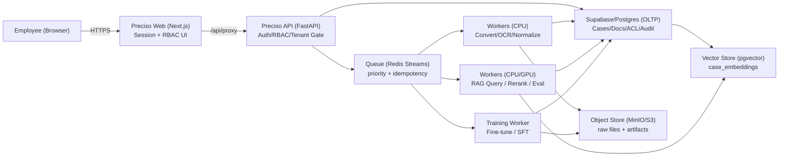

# Preciso Enterprise Non‑Dev + Central RAG/LLM Master Plan v1

Date: 2026-02-12  
Repo: `/Users/leesangmin/Desktop/preciso`

## 0) Goal (What “Done” Looks Like)
기업(tenant)당 중앙 서버에 **RAG 1개 + LLM 1개**를 운영하고, 기업 내 모든 직원이 “웹 UI 하나”로 다음을 비개발자 수준에서 수행한다.

1. 외부 API 연결(키 등록/테스트) + 내부 금융파일 업로드
2. 데이터 정제/정규화(Findistill/DataForge) → Spokes A/B/C/D 생성
3. RAG 질문 → **근거(evidence) 기반 답변** 수신
4. 승인(HITL) → 승인 데이터만 학습 후보로 누적(배치/자동 둘 다)
5. 모델 학습/파인튜닝 실행(로컬 모델 포함) → 모델 선택(Serving)까지 UI로 완료
6. 직원은 기본적으로 **내 파일만** 보며, 팀/친구 공유는 명시적 ACL로만 가능
7. 모든 과정은 감사(audit) 가능하고, 실패 시 원인/재시도/복구 경로가 UI에 노출된다.

---

## 1) Current State (What Preciso Already Has)
아래는 현재 코드 기준 “이미 구현된 것” 요약이다.

### 1.1 멀티테넌트/권한/협업
- Tenant header 강제 옵션 및 tenant context 존재.
- Org Directory + 역할(Role) 해석(예: `"auto"` → org role resolve) 구현.
- 협업 도메인(개인/팀 space, 파일 ACL, 친구/전송) 구현.
- 기본 정책: 개인 파일 기본 비공개 + 명시적 공유만 노출.

관련 파일(예시)
- Backend auth: `/Users/leesangmin/Desktop/preciso/app/core/auth.py`
- Org API/service: `/Users/leesangmin/Desktop/preciso/app/api/v1/org.py`, `/Users/leesangmin/Desktop/preciso/app/services/org_service.py`
- Collab store/api: `/Users/leesangmin/Desktop/preciso/app/services/enterprise_collab.py`, `/Users/leesangmin/Desktop/preciso/app/api/v1/collab.py`

### 1.2 데이터 ingest/정제/Spokes
- Ingest API(파일 업로드/async) + 중복 업로드 방지(file_hash) + queued→worker 처리.
- UnifiedConversionEngine(문서 변환 엔진) + 품질 게이트/요약 기록.
- Spokes A/B/C/D 생성 로직(승인 이벤트 기반 Spoke A/B 등 WS8 반영).

관련 파일(예시)
- Ingest: `/Users/leesangmin/Desktop/preciso/app/api/v1/ingest.py`
- Worker: `/Users/leesangmin/Desktop/preciso/app/worker.py`
- Spokes: `/Users/leesangmin/Desktop/preciso/app/services/spokes.py`

### 1.3 RAG(근거 기반) + 안전장치
- RAG 엔드포인트가 Collab 허용 `doc_id` 기반 하드 필터 수행(누수 방어 2중화).
- Role policy(뷰어/분석가/리뷰어/관리자)별 evidence/causal/prediction 노출 조절.
- RAG cache/rerank/compress 플래그 존재(+ UI에서 토글 가능).
- Supabase RPC(hybrid search) 지원 + DB 레벨 필터(tenant/owner/doc_ids) 적용(bootstrap SQL 반영).

관련 파일(예시)
- RAG API: `/Users/leesangmin/Desktop/preciso/app/api/v1/rag.py`
- RAG engine: `/Users/leesangmin/Desktop/preciso/app/services/spoke_c_rag.py`
- Supabase bootstrap: `/Users/leesangmin/Desktop/preciso/supabase_all_in_one_safe.sql`

### 1.4 승인→학습(초기 MLOps)
- 승인(approve/reject/request-changes) role gate(reviewer/admin) 적용.
- 승인 시 MLflow run candidate 이벤트 기록 + training run API/UI 존재.
- 로컬 트레이닝은 `LOCAL_TRAINING_COMMAND` 기반으로 시작 가능(현재는 스레드로 프로세스 실행).

관련 파일(예시)
- Approval: `/Users/leesangmin/Desktop/preciso/app/api/v1/approval.py`
- Training: `/Users/leesangmin/Desktop/preciso/app/services/training_service.py`
- MLflow API/UI: `/Users/leesangmin/Desktop/preciso/app/api/v1/mlflow_api.py`, `/Users/leesangmin/Desktop/preciso/web/app/mlops/page.tsx`

### 1.5 중앙 파이프라인(큐/잡/관측성 기초)
- Redis Streams 기반 큐 모드(ack, stale-claim, DLQ) 구현.
- `pipeline_jobs` + `tenant_pipeline_quotas` + `tenant_pipeline_profiles` 구현.
- RAG/async ingest는 pipeline job으로 기록/상태 업데이트(일부 동기 경로 포함).

관련 파일(예시)
- Queue: `/Users/leesangmin/Desktop/preciso/app/services/task_queue.py`
- Pipeline API/store: `/Users/leesangmin/Desktop/preciso/app/api/v1/pipeline.py`, `/Users/leesangmin/Desktop/preciso/app/services/enterprise_collab.py`

### 1.6 Web UI(비개발자 UX 기반 이미 존재)
- 홈/콘솔/설정/SDKUI/콜라보/로그/거버넌스/레이크하우스/MLops 페이지 존재.
- `/api/proxy`를 통해 세션 기반으로 헤더 주입(브라우저에 시크릿 저장 최소화).

관련 파일(예시)
- Home: `/Users/leesangmin/Desktop/preciso/web/app/page.tsx`
- Ops console: `/Users/leesangmin/Desktop/preciso/web/app/ops-console/page.tsx`
- Settings(flags): `/Users/leesangmin/Desktop/preciso/web/app/settings/page.tsx`
- SDKUI(키 발급/외부키 등록/테스트): `/Users/leesangmin/Desktop/preciso/web/app/sdkui/page.tsx`

---

## 2) Gap Analysis (What’s Missing vs Goal)
아래는 “비개발자 + 기업 중앙 서버 1대” 운영 관점에서 남아있는 핵심 갭이다.

### G1. 중앙 서버 RAG/LLM “공유 엔진”은 있으나, **완전한 비동기/공정성 파이프라인**이 필요
현재:
- 변환(ingest/convert)은 worker + 큐가 잘 맞물림.
- RAG는 동기 실행(파이프라인 잡 기록은 됨)이라 동시 사용자 증가 시 API 서버가 병목 가능.
필요:
- `rag`도 “queue + worker”로 옵션 제공(특히 대량/장문 쿼리, 재평가, batch eval).
- 사용자 공정성(tenant+user 토큰버킷)과 우선순위(Interactive > Approval > Ingest > Batch)의 강제 적용.

### G2. “외부 API → 정제 → Spokes → RAG”를 사용자가 클릭으로 구성하는 **Connectors/Pipeline UI**가 더 필요
현재:
- SDKUI에서 외부 키 등록/테스트/샘플 ingest가 가능(좋음).
필요:
- 운영 UI에서 “커넥터 활성화 + 스케줄 + ingest 대상(entity/ticker) + 품질게이트 + 저장 위치”를 템플릿화.
- “키 등록(Secret) → 테스트 → 샘플 ingest → 정기 수집”의 단계형 마법사(wizard) UX.

### G3. 승인→학습은 가능하나, 비개발자용 “원클릭 학습/모델 선택/롤백”을 끝까지 단순화해야 함
현재:
- MLOps 페이지에서 dataset_version 생성/선택, training run 실행, 모델 선택이 가능.
필요:
- “승인 즉시 자동학습”과 “배치로 모아 학습”을 UI에서 명확히 분리(정책/스케줄/예산/쿼터 포함).
- 로컬 모델 경로/학습 커맨드 기반은 남기되, **Job 기반 상태/로그/재시도**가 동일하게 보여야 함.

### G4. 증거 메타 품질(특히 문서/페이지/스니펫)와 숫자 보존 검증을 더 강화해야 함
현재:
- evidence-first 구조와 일부 품질 게이트 존재.
필요:
- “cell-level 숫자 보존” 자동 검사(표↔facts 대응) 확대.
- OCR 정책(텍스트 레이어 감지→OCR) 및 fallback 순서를 고정하고, 실패 시 needs_review 자동 라우팅.

---

## 3) Target Architecture (Enterprise Central RAG/LLM)

고정 원칙:
- **중앙 엔진 공유**: 테넌트당 “RAG 인덱스/LLM 설정/쿼터”는 공유하고, 사용자 가시성은 ACL로 분리.
- **IO/Compute 분리**: 브라우저는 업로드/승인/보기만. 변환/임베딩/학습은 워커가 전담.
- **승인 데이터만 학습**: approvals → spoke_a_samples/dataset_versions 누적 → training.

---

## 4) Non‑Developer UX (Primary Flows)
각 플로우는 “마법사형”으로 30분 내 세팅을 목표로 한다.

### 4.1 온보딩(기업 설치 후 첫 30분)
1. Setup Wizard(`/web/app/setup`)
2. 연결값 입력(DB/Redis/Base URL) → Preflight check(`/api/v1/status`)
3. 권한/조직 사용자(Org) 등록(`/web/app/org`)
4. 첫 파일 업로드(`/web/app/dataforge`) → 변환 완료 확인
5. RAG 질문(`/web/app/console`) → evidence 확인
6. 승인(`/web/app/console` 또는 approvals UI) → spoke A/B 생성 확인
7. 학습 정책 선택: “자동(승인 즉시)” vs “배치(모아서)”(`/web/app/mlops`)

### 4.2 외부 API 연결(Connector)
1. Provider 선택(FRED/Finnhub/FMP/Partner feed…)
2. 키 등록(서버 저장 or BYO env) + 테스트 호출
3. 수집 대상 설정: ticker/entity + 주기(cron) + 품질게이트(최소 evidence/정규화)
4. 첫 ingest 실행 → Spokes 생성 → RAG에서 근거로 사용

UI 후보:
- `/web/app/sdkui`(현재 기능) + 향후 `/web/app/connectors`로 운영 UI 승격

### 4.3 승인→학습(자동/배치)
- 자동: 승인 이벤트 발생 → quality gate 통과 시 training job 자동 제출.
- 배치: dataset_version에 승인 샘플 누적 → “Seal” 후 한 번에 학습 실행.
- Serving: 모델 리스트에서 “Serving” 선택 + 롤백.

---

## 5) Workstreams (Detailed Delivery Plan)
아래는 “현재 코드 기반에서 기업용 완성도”를 높이는 작업 순서다.

### Phase 0 (Now) — “Single Tenant Central Engine” 안정화 (1주)
Goal: 동시 사용자 증가 시에도 중앙 서버가 버티고, 운영자가 문제를 바로 찾는다.

- WS0. Pipeline Job 표준화
  - 모든 주요 경로(ingest/rag/approval/train/export)에 `pipeline_jobs` 생성 + 상태 업데이트 표준화
  - end-to-end job_id trace(로그/DB/응답에 일관되게)
  - DoD: UI에서 job_id로 “어디서 멈췄는지” 확인 가능

- WS1. Queue/Worker 안정성(중복·유실·폭주 방지)
  - idempotency 키 고정(tenant+file_hash+user)
  - visibility timeout/lease + stale-claim 정책 운영 기준 고정
  - DLQ → UI에서 재시도/해제 버튼

Tests
- 200 동시 요청에서 interactive RAG가 queue 정책을 지키는지(부하 테스트)
- worker crash 시 job 재할당/복구

### Phase 1 — Connectors(외부 API) “비개발자 셀프서비스” (1~2주)
- WS2. Integration Secret store 정책 확정
  - 브라우저 저장 금지, 서버 암호화 저장 옵션, rotate 절차/UX
- WS3. Connector Wizard + Scheduler
  - 키 등록 → 테스트 → 수집 대상 → 첫 ingest → 품질 리포트
  - 수집 실패 원인 분류(키 문제/쿼터/벤더 장애/파서)

DoD
- 사용자가 env 없이도 UI로 provider 등록 + 샘플 ingest + RAG 근거 확인 가능

### Phase 2 — Approval→Training “완전 비개발자” (1~2주)
- WS4. Training Job Worker화
  - `training_service`가 로컬 스레드 spawn이 아니라 queue 기반 job으로 동작
  - 학습 로그/아티팩트/모델 레지스트리 갱신까지 job으로 추적
- WS5. 모델 선택 UX 정리
  - “Serving 모델 1개” + 롤백 + 배치 학습 스냅샷(데이터/델타 버전)

DoD
- “승인→자동학습”과 “배치학습”이 UI에서 명확히 분리되어 클릭 2~3번 내 완료

### Phase 3 — Data Quality “XML급 iXBRL/표 품질” 강화 (2~3주)
- WS6. 숫자 보존 검증(표 cell ↔ facts) 자동화 확대
- WS7. OCR 정책 고정(텍스트레이어→OCR→로컬파서) + 품질 실패 시 needs_review 자동 라우팅
- WS8. Evidence 강제(문서/페이지/스니펫/방법/신뢰도) 결손 금지

DoD
- “조용히 빈 facts” 금지: 0 facts면 fallback 트리 실행 + 결과/원인 로그

---

## 6) What To Change (Concrete Backlog by Layer)

### Backend/API
- `/api/v1/rag/query` 비동기 옵션 추가: `mode=sync|async`
- `/api/v1/pipeline/jobs/*`에 “재시도/취소/DLQ 이동” 추가
- Approval 이벤트에 “예측 결과(prediction_outcome)” 후속 기록 API 추가(학습 피드백 루프)

### Worker/Queue
- Training worker(로컬 모델/LoRA 등) 표준 entrypoint 제공
- RAG worker(heavy query, rerank, eval suite) 분리

### DB
- `pipeline_jobs` 상태 머신 확장: `pending → processing → completed|failed|retrying|dead_letter|canceled`
- `audit_events`에 job_id/tenant_id/user_id/doc_id를 고정 키로 추가(검색/필터)

### Web UI
- “Operations Console(Scale.com 스타일)”의 최상위 IA 고정
  - Connectors, Ingest, Review/Approval, RAG Console, Training, Models, Logs, Governance, Settings
- 각 탭은 “현재 상태 + 다음 행동(CTA)” 중심으로 단순화
  - 예: Training 탭은 “Auto/Batch 선택 → Dataset 선택 → Run → Serving 선택”

---

## 7) Acceptance Criteria (Enterprise MVP)
1. 직원 기본 격리: 내 문서만 보이고, 공유는 ACL로만 가능.
2. 외부 API 연결: UI에서 키 등록/테스트/샘플 ingest 가능.
3. 대량 업로드: 브라우저는 업로드만, 변환은 worker 처리(큐/재시도/DLQ 포함).
4. RAG 답변: evidence 필수, 근거 없으면 “모름/근거없음”.
5. 승인 후 학습: 자동/배치 모두 UI에서 가능, 승인 데이터만 학습에 들어감.
6. 모델 선택: Serving 모델 1개 + 롤백이 UI에서 가능.
7. 감사/로그: job_id로 업로드→변환→RAG→승인→학습까지 trace 가능.

---

## 8) Rollout / Risk
### Rollout
- Canary tenant 1개로 기능 플래그를 켜고(설정 UI), 작업 성공률/지연시간/오류 분류를 본다.
- 이후 tenant 단위로 점진 활성화.

### Top Risks
- RAG/학습이 API 서버에서 동기로 남아 병목이 되는 문제
  - Mitigation: queue + worker화, caching/rerank/compress 자동 토글(성능 기준)
- evidence 품질 저하(특히 표/단위/기간)
  - Mitigation: 숫자 보존 검사 + unit/period 정규화 룰 고정 + needs_review 라우팅

---

## 9) Immediate Next Step (1~2일 내)
1. `rag` async 모드(큐/워커) 추가 설계 확정 + 최소 구현(heavy query만)
2. training을 queue 기반으로 전환(프로세스 spawn → job)
3. connectors 운영 UI(`/web/app/connectors`) 초안 IA 만들기(SDKUI 기능 승격)

